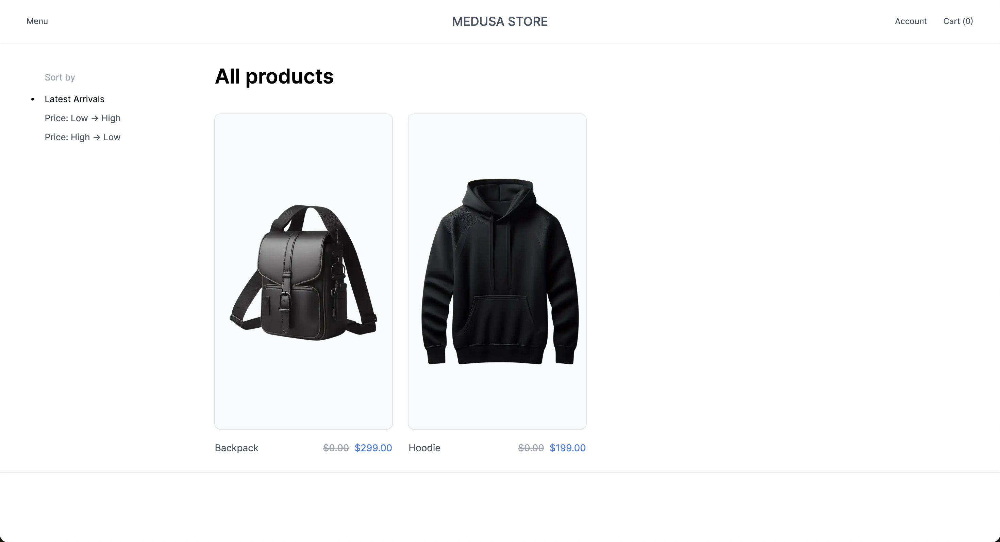
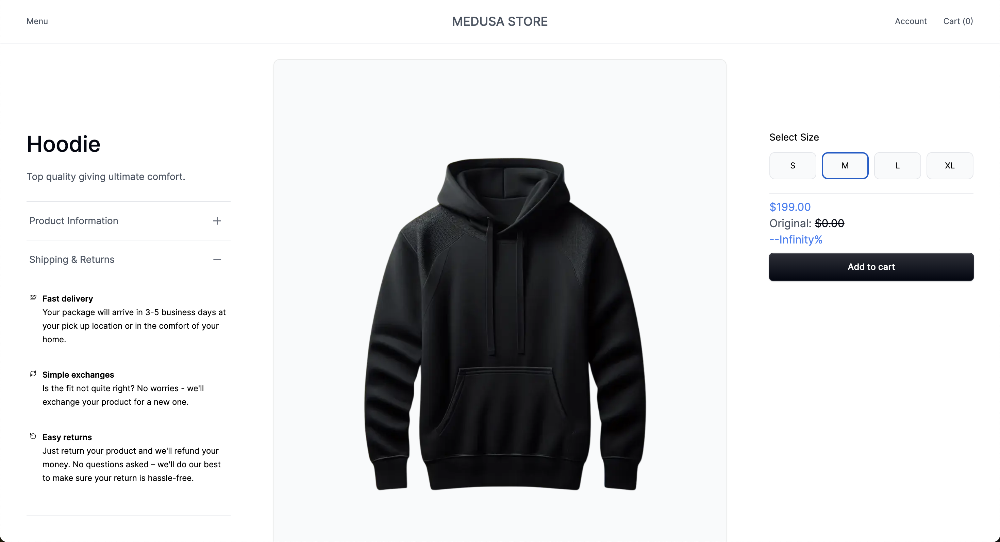

# Ecommerce App
# Getting Started

### Setting up the environment variables

Navigate into your projects directory and get your environment variables ready:

```shell
mv .env.template .env.local
```

### Install dependencies

Use Yarn to install all dependencies.

```shell
yarn
```

### Start developing

```shell
yarn dev
```

Your site is now running at http://localhost:8000!

# Screenshots

### Product List Page

### Product Detail Page
